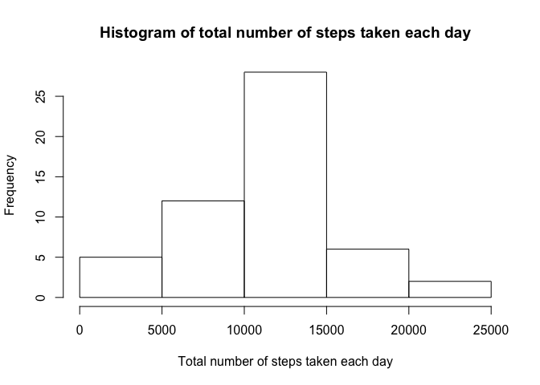
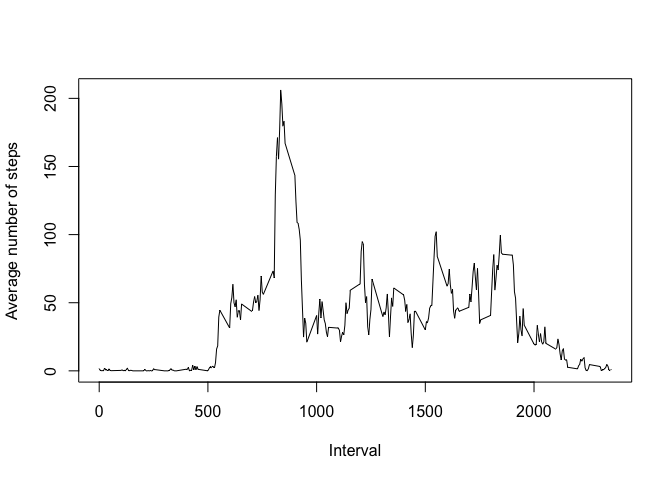
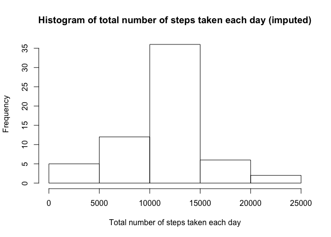
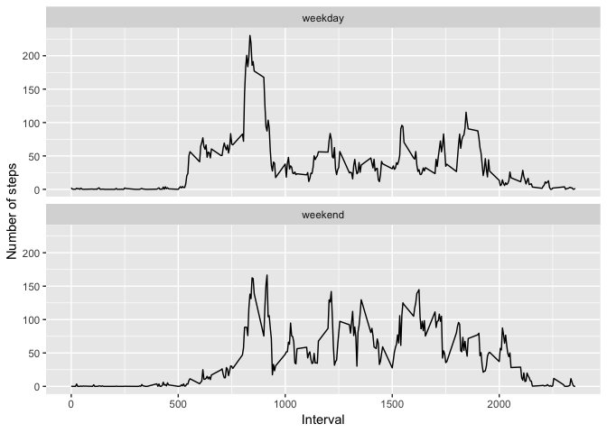

## Loading and preprocessing the data
Load the data

```r
unzip('activity.zip')
activity <- read.csv('activity.csv')
```


## What is mean total number of steps taken per day?
Histogram of the total number of steps taken each day

```r
total_steps_per_day <- aggregate(steps ~ date, activity, sum, na.action = na.omit)
hist(total_steps_per_day$steps, xlab = 'Total number of steps taken each day', main = 'Histogram of total number of steps taken each day')
```

<!-- -->

The mean of total number of steps taken per day

```r
mean(total_steps_per_day$steps)
```

```
## [1] 10766.19
```
The median of total number of steps taken per day

```r
median(total_steps_per_day$steps)
```

```
## [1] 10765
```

## What is the average daily activity pattern?
A time series plot of the 5-minute interval and the average number of steps taken, averaged across all days.

```r
avg_steps <- aggregate(steps ~ interval, activity, mean, na.action = na.omit)
plot(avg_steps$interval, avg_steps$steps, type = 'l', xlab = 'Interval', ylab = 'Average number of steps')
```

<!-- -->

The interval that contains the maximum number of steps.

```r
avg_steps[which.max(avg_steps$steps), 'interval']
```

```
## [1] 835
```

## Imputing missing values
The total number of missing values in the dataset.

```r
sum(is.na(activity))
```

```
## [1] 2304
```
Fill in all of the missing values in the dataset using the mean for the 5-minute interval and assign the result to a new dataset 'activity_imputed'.

```r
library(plyr)
library(Hmisc)
```

```
## Loading required package: lattice
```

```
## Loading required package: survival
```

```
## Loading required package: Formula
```

```
## Loading required package: ggplot2
```

```
## 
## Attaching package: 'Hmisc'
```

```
## The following objects are masked from 'package:plyr':
## 
##     is.discrete, summarize
```

```
## The following objects are masked from 'package:base':
## 
##     format.pval, units
```

```r
activity_imputed <- ddply(activity, 'interval', mutate, steps = impute(steps, mean))
```
Histogram of the total number of steps taken each day

```r
total_steps_per_day <- aggregate(steps ~ date, activity_imputed, sum, na.action = na.omit)
hist(total_steps_per_day$steps, xlab = 'Total number of steps taken each day', main = 'Histogram of total number of steps taken each day (imputed)')
```

<!-- -->

The mean of total number of steps taken per day

```r
mean(total_steps_per_day$steps)
```

```
## [1] 10766.19
```
The median of total number of steps taken per day

```r
median(total_steps_per_day$steps)
```

```
## [1] 10766.19
```
Comparing to the histogram of the data before imputing, the frequency of the total number of steps in the range of 10000 to 15000 increased from 25 to 35. The mean value is the same for both datasets, but the median value of the imputed data is a little higher than that of the un-imputed data.

## Are there differences in activity patterns between weekdays and weekends?
Create a new factor variable in the dataset with two levels -- "weekday" and "weekend" indicating whether a given date is a weekday or weekend day.

```r
activity_imputed$date <- as.Date(activity_imputed$date, format = '%Y-%m-%d')
weekends <- c('Saturday', 'Sunday')
activity_imputed$day_type <- as.factor(ifelse(weekdays(activity_imputed$date) %in% weekends, 'weekend', 'weekday'))
str(activity_imputed$day_type)
```

```
##  Factor w/ 2 levels "weekday","weekend": 1 1 1 1 1 2 2 1 1 1 ...
```
A panel plot containing a time series plot of the 5-minute interval and the average number of steps taken, averaged across all weekday days or weekend days.

```r
avg_steps_by_interval_daytype <- aggregate(steps ~ interval + day_type, activity_imputed, mean)
library(ggplot2)
fig <- qplot(interval, steps, data = avg_steps_by_interval_daytype, geom = 'line', xlab = 'Interval', ylab = 'Number of steps')
fig + facet_wrap(~day_type, ncol = 1)
```

<!-- -->
